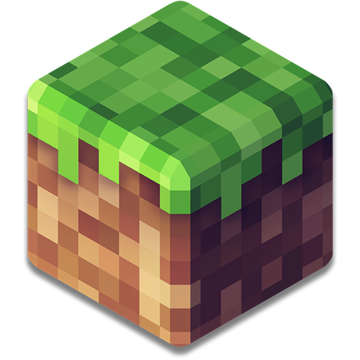

<h1 align="center">MCLoader</h1>

    
    
    

Небольшой скрипт который поможет вам скачать ассеты и клиенты для Minecraft с официального зеркала Mojang

## Использование

Перейти в раздел [Releases](https://github.com/AuroraTeam/MCLoader/releases) и скачать последнюю версию.

- 1. Если у вас на сервере установлен интерпретатор `Node.js`, для вас подойдёт вариант с загрузкой файла `MCLoader.js`.  
Скачайте и положите его в любую папку. После чего его можно запускать командой `node MCLoader.js`.
- 2. Если у вас не установлен интерпретатор `Node.js`, можно скачать бинарный файл под свою операционную систему.

По умолчанию количество одновременно скачиваемых файлов равно `8`  
Вы можете переопределить это в файле конфигурации `config.json` (значение `concurrency`)  
Файл создастся при первом запуске скрипта  
При указании большего количества, у вас может возникнуть ошибка `connect ETIMEDOUT`  
В таком случае попробуйте удалить папку и скачать клиент/ассеты ещё раз, либо уменьшите количество одновременно скачиваемых файлов

## Лицензия

Данный скрипт содержит частично изменённый код проекта Aurora Launcher [LauncherServer](https://github.com/AuroraTeam/LauncherServer) 
распространяемый под лицензией GNU General Public License v3.0

Также сам скрипт аналогично распространяется по лицензии GNU General Public License v3.0

Использование частей кода как Aurora Launcher LauncherServer, так и данного скрипта без указания авторства **запрещено**!

